# Cortex-A9 HAL DSP System with NEON SIMD Acceleration

| Item                  | Description                                                                 |
| --------------------- | --------------------------------------------------------------------------- |
| Platform              | DE1-SoC                                                                     |
| Architecture          | ARMV7-A                                                                     |
| Core                  | ARM Cortex-A9                                                               |
| Processor             |  Hard Processor System                                                      |
| Compiler              | ARM DS IDE                                                                  |
| Programming Model     | Bare-metal C with direct register access                                    |
| Compiler Optimization | `-O3` and `-O0`                                                                     |
| Main Focus            | Embedded DSP processing, hardware interfacing and performance optimization  |

## 1. Project Overview

This project is a bare-metal embedded DSP application developed for the DE1-SoC platform. This system uses the ARM Cortex-A9 processor inside the Cyclone V SoC to perform audio, SDR, image and sensor processing without an operating system.

The application combines low-level hardware control with optimized signal-processing algorithms. It directly accesses HPS peripheral registers, communicates with FPGA-mapped IP blocks, reads and writes files using FatFs, controls external devices through I2C and accelerates computationally expensive algorithms using ARM NEON SIMD intrinsics with vector arithmetics.

The main idea of the project is to demonstrate how the Cortex-A9 can be used as a complete embedded processing platform. The board switches are used to select different modes, while LEDs, HEX displays, UART output, audio playback and the LT24 LCD provide feedback and output.

The system supports the following major features:

* Audio FIR filtering and playback on CODEC
* SDR FIR and FFT filtering for I/Q samples.
* Kalman filtering for ADXL345 accelerometer data.
* Median filtering for BMP images.
* UART export of raw and filtered DSP data.
* LCD display of raw and filtered BMP images.
* FPGA-mapped switch, LED, button, HEX, audio FIFO and LCD GPIO access.

A major part of the project is the comparison between scalar C implementations and ARM NEON vectorized implementations. The benchmark results show that NEON provides significant acceleration for DSP workloads while maintaining numerical correctness.

## 2. Block Diagram

```mermaid
flowchart TB
    User["User Inputs<br/>Switches SW0-SW9<br/>Buttons KEY0-KEY1"] --> Main["src/main.c<br/>Startup, Mode Selection,<br/>Runtime Service Loop"]

    subgraph Core["ARM Cortex-A9 Core Runtime"]
        GIC["GIC Driver<br/>core/src/gic.c"]
        IRQ["IRQ Dispatch Table<br/>core/src/irq.c"]
        PTIM["Private Timer<br/>1 ms Tick + delay()"]
        Cache["Cache Maintenance<br/>L1/L2 clean, purge, sync"]
    end

    subgraph HPS["HPS Peripheral Drivers"]
        Clock["Clock Manager<br/>hps/src/clock.c"]
        SysMgr["System Manager Mux<br/>hps/src/sysmgr.c"]
        GPIO["HPS GPIO<br/>hps/src/gpio.c"]
        UART["UART0<br/>Debug + DSP Host Protocol"]
        I2C["I2C0<br/>Codec / Accelerometer Control"]
        SDMMC["SDMMC Framework<br/>hps/src/sdmmc.c"]
        RST["Reset Manager<br/>hps/src/rstmgr.c"]
        WDT["Watchdog<br/>hps/src/wdt.c"]
    end

    subgraph FPGA["FPGA Lightweight Bridge IP"]
        LEDIP["LED IP<br/>Mode and Error Indicators"]
        SwitchIP["Switch IP<br/>Feature Selection"]
        ButtonIP["Button IP<br/>Volume Control"]
        HEXIP["HEX Display IP<br/>HOLD, READY, PLAY, DONE"]
        CodecIP["Audio Codec FIFO IP<br/>Left/Right Sample Writes"]
        GPIOIP["JP1 GPIO IP<br/>LT24 Parallel Interface"]
    end

    subgraph Devices["External Devices"]
        ADXL["ADXL345 Accelerometer<br/>I2C Sensor Data"]
        WM8731["WM8731 Audio Codec<br/>I2C Configuration"]
        LT24["LT24 LCD Display<br/>RGB565 Pixel Output"]
    end

    subgraph Storage["FatFs Filesystem / SD Card Assets"]
        Navtex["navtex.wav<br/>Stereo I/Q SDR Input"]
        AudioRaw["audiodata.wav<br/>Mono 16-bit 48 kHz Audio"]
        AudioFil["audiodatafil.wav<br/>Generated Filtered Audio"]
        BmpRaw["minion.bmp<br/>Raw 24-bit BMP"]
        BmpFil["minionfil.bmp<br/>Generated Filtered BMP"]
        Frames["Embedded Frames<br/>dsp/src/data.c"]
    end

    subgraph DSP["DSP and Media Pipelines"]
        Parser["dsp/src/parser.c<br/>WAV/BMP Parsing + Dispatch"]
        SDRFIR["SDR FIR Pipeline<br/>fir_sdr.c<br/>51-tap NEON FIR"]
        SDRFFT["SDR FFT Pipeline<br/>fft_sdr.c<br/>FFT, Weighting, IFFT"]
        AudioFIR["Audio FIR Pipeline<br/>fir_audio.c<br/>64-tap NEON Bandpass"]
        Kalman["Kalman Pipeline<br/>kalman.c<br/>3-axis NEON Filter"]
        Median["Image Median Pipeline<br/>median_image.c<br/>Selective 3x3 Median"]
        UartProto["DSP UART Protocol<br/>Raw/Filtered Float Export"]
        AudioRuntime["audio/src/audio.c<br/>WAV to RAM + Playback"]
        ImageRuntime["image/src/image.c<br/>BMP to RAM + LCD Draw"]
    end

    subgraph Outputs["Visible / Audible / Host Outputs"]
        Host["Host PC / UART Tool<br/>Raw and Filtered Float Packets"]
        AudioOut["Speaker / Line Out<br/>Raw or Filtered Playback"]
        LCDOut["LT24 LCD<br/>Boot Frames + BMP Display"]
        StatusOut["Board LEDs + HEX<br/>Progress and State Feedback"]
        Console["Console Prints<br/>Timing, Sensor Data, Debug"]
    end

    Main --> GIC
    Main --> PTIM
    Main --> GPIO
    Main --> UART
    Main --> I2C
    Main --> Parser
    Main --> AudioRuntime
    Main --> ImageRuntime

    GIC --> IRQ
    PTIM --> IRQ
    UART --> IRQ
    IRQ --> UartProto
    PTIM --> WDT
    Cache --> SDMMC

    Clock --> GPIO
    SysMgr --> UART
    SysMgr --> I2C
    SysMgr --> SDMMC
    RST --> SDMMC

    Main --> SwitchIP
    User --> SwitchIP
    User --> ButtonIP
    Main --> LEDIP
    Main --> HEXIP

    I2C --> ADXL
    I2C --> WM8731
    GPIOIP --> LT24
    CodecIP --> WM8731

    Navtex --> Parser
    AudioRaw --> Parser
    BmpRaw --> Parser
    Parser --> AudioFil
    Parser --> BmpFil

    Parser --> SDRFIR
    Parser --> SDRFFT
    Parser --> AudioFIR
    Parser --> Median
    ADXL --> Kalman

    SDRFIR --> UartProto
    SDRFFT --> UartProto
    AudioFIR --> UartProto
    AudioFIR --> AudioFil
    Median --> BmpFil

    AudioRaw --> AudioRuntime
    AudioFil --> AudioRuntime
    AudioRuntime --> CodecIP
    CodecIP --> AudioOut
    ButtonIP --> AudioRuntime

    BmpRaw --> ImageRuntime
    BmpFil --> ImageRuntime
    Frames --> ImageRuntime
    ImageRuntime --> GPIOIP
    LT24 --> LCDOut

    UartProto --> UART
    UART --> Host
    Kalman --> Console
    LEDIP --> StatusOut
    HEXIP --> StatusOut
```



The block diagram shows that the project is a complete embedded software stack rather than a single isolated DSP function. The `main.c` file controls the application flow, while the core, HPS, FPGA, device, DSP, audio and image modules each handle a specific part of the system.

## 3. Objectives

1. Develop a complete bare-metal application for the ARM Cortex-A9 on the DE1-SoC platform.
2. Use direct register-level programming to control HPS peripherals and FPGA-mapped IP.
3. Interface with external devices including the ADXL345 accelerometer, WM8731 audio codec and LT24 LCD.
4. Use FatFs to read and write WAV and BMP files.
5. Implement audio, SDR, image and sensor-processing pipelines.
6. Optimize DSP algorithms using ARM NEON intrinsics.
7. Compare scalar and vectorized performance using measured benchmarks.
8. Provide visible, audible and host-side outputs for demonstration and validation.

## 4. Technologies Used

| Category             | Technologies / Components Used                          |
| -------------------- | ------------------------------------------------------- |
| Filesystem           | FatFs                                                   |
| Peripherals          | UART, I2C, SDMMC, DMA, GPIO, Clock, RSTMGR, SYSMGR, WDT, Cache, GIC, Private timer                                             |
| External Devices     | ADXL345, WM8731, LT24 LCD                               |
| FPGA IP              | LEDs, switches, buttons, HEX, audio FIFO, LCD GPIO      |
| File Formats         | WAV, BMP                                                |
| DSP Algorithms       | FIR, FFT-domain filtering, Kalman filter, Median filter |

## 5. Methodology

The project was developed using a layered embedded-system approach. The low-level platform was brought up first, followed by peripheral drivers, external device interfaces, file parsing, DSP algorithms and final runtime integration.

1. **Hardware initialisation:** Initialize GIC, private timer, GPIO, UART and I2C.
2. **Board feedback:** Use LEDs and HEX displays to show startup, ready, processing and error states.
3. **File handling:** Use FatFs to load WAV and BMP files from SD card to RAM.
4. **DSP implementation:** Implemented scalar versions first and then created NEON-optimized versions.
5. **Verification:** Compared scalar and vector outputs.
6. **Benchmarking:** Measured processing time and removed the scalar versions for audio, Kalman and SDR.
7. **Runtime integration:** Connected processing results to UART, audio playback, LCD display, LEDs and HEX feedback.

This method reduces risk because each layer can be tested before being combined into the full application.

## 6. Implementation

### 6.1 Application Control

The main application logic is implemented in `src/main.c`. This file controls system initialization, switch-based mode selection, DSP preprocessing, media loading and runtime operation.

The startup sequence is:

1. Show `HOLD` on the HEX display.
2. Initialize the GIC.
3. Initialize the private timer.
4. Initialize GPIO.
5. Initialize UART.
6. Initialize I2C.
7. Mount the FatFs filesystem.
8. Initialize selected external devices depending on switch state.
9. Run selected DSP processing functions.
10. Enter the main loop.

The main loop handles audio playback, image display, Kalman sensor reading, UART data requests and status updates.

### 6.2 Mode Selection

The DE1-SoC switches used as the main user interface.

| Switch | Function                         |
| ------ | -------------------------------- |
| SW0    | SDR FIR filtering                |
| SW1    | SDR FFT filtering                |
| SW2    | Audio FIR filtering              |
| SW3    | ADXL345 Kalman filtering         |
| SW4    | Audio I2C path / codec selection |
| SW5    | Median image filtering           |
| SW6    | Display filtered image           |
| SW7    | Display unfiltered image         |
| SW8    | Play filtered audio              |
| SW9    | Play unfiltered audio            |

The pushbuttons used for audio volume control:

| Button | Function        |
| ------ | --------------- |
| KEY0   | Decrease volume |
| KEY1   | Increase volume |

### 6.3 Core Runtime

The `core` layer provides CPU-level services required by the bare-metal system.

* The **GIC driver** enables interrupt routing to the Cortex-A9.
* The **IRQ dispatcher** maps interrupt IDs to C handler functions.
* The **private timer** generates a 1 ms system tick, used for both delay functions and benchmarking.

### 6.4 HPS Peripheral Drivers

The `hps` layer contains low-level drivers for the hard processor system.

* **UART0** is used for debug output and DSP data export.
* **I2C0** is used to configure the ADXL345 accelerometer and WM8731 codec.
* **GPIO** is used for board-level control and for LED.
* **System manager** functions configure pin muxing.
* **Clock and reset** functions support peripheral bring-up.
* **Watchdog** support prevents unwanted reset.

These drivers are written using direct register access and memory-mapped C structures.

### 6.5 FPGA-Mapped IP

The FPGA lightweight bridge exposes board peripherals as memory-mapped IP blocks. The software accesses them using helper functions.

The FPGA IP blocks used are:

* LEDs for status indication.
* Switches for mode selection.
* Keys for volume control.
* HEX displays for system state text.
* Audio FIFO for writing audio samples.
* GPIO IP for controlling the LT24 LCD.

### 6.6 External Device Drivers

#### ADXL345 Accelerometer

The ADXL345 is configured over I2C. It provides X, Y and Z acceleration values. The raw sensor data is filtered using a NEON-based Kalman filter and roll and pitch angles are calculated from the filtered values.

#### WM8731 Audio Codec

The WM8731 codec is configured over I2C. After initialization, audio samples are written to the codec through the FPGA audio FIFO. This allows raw and filtered WAV files to be played from the RAM.

#### LT24 LCD Display

The LT24 LCD is controlled through FPGA GPIO bit banging. BMP images are converted from RGB888 to RGB565 and displayed on the LCD.

### 6.7 Audio FIR Pipeline

The audio FIR pipeline reads `audiodata.wav`, converts the 16-bit PCM samples into floating-point values, applies FIR filtering, and writes the filtered output to `audiodatafil.wav`.

The pipeline is:

```text
audiodata.wav -> WAV parser -> float samples -> FIR filter -> audiodatafil.wav -> playback
```

The audio FIR filter was implemented in both scalar and NEON versions. The NEON version reduces execution time by processing multiple samples in parallel.

### 6.8 SDR FIR Pipeline

The SDR FIR pipeline reads `navtex.wav` as stereo I/Q data. The left channel is treated as the I component, and the right channel is treated as the Q component.

The pipeline is:

```text
navtex.wav -> I/Q extraction -> FIR on I -> FIR on Q -> UART export
```

Both I and Q outputs was compared against scalar reference results to verify correctness.

### 6.9 SDR FFT Pipeline

The SDR FFT pipeline performs frequency-domain filtering on complex SDR samples.

The pipeline is:

```text
I/Q samples -> FFT -> frequency weighting -> IFFT -> filtered I/Q output
```

The FFT implementation includes radix-2 butterfly processing, bit reversal, twiddle factors, inverse FFT and LUT-based optimization.

### 6.10 Kalman Filter Pipeline

The Kalman filter smoothens noisy accelerometer values from the ADXL345 sensor. The X, Y and Z axes are processed together using NEON vector operations.

The simplified Kalman update is:

```text
p = p + q
k = p / (p + r)
x = x + k*(measurement - x)
p = (1 - k)*p
```

This improves stability of the accelerometer output and provides cleaner roll and pitch calculations.

### 6.11 Median Image Pipeline

The median filter is applied to BMP image data. It uses a 3x3 window and is designed mainly for salt-and-pepper noise removal.

The project uses selective median filtering. Pixels are filtered only when the channel value is `0` or `255`, which helps reduce noise without unnecessarily blurring the full image.

### 6.12 UART DSP Protocol

The UART protocol allows a host PC to request raw or filtered DSP data.

The command set includes:

| Command | Meaning               |
| ------- | --------------------- |
| `0xF0`  | Start configuration   |
| `0xF1`  | Configuration done    |
| `0xF2`  | Request raw data      |
| `0xF3`  | Request filtered data |
| `0xF4`  | Reset protocol        |
| `0xF5`  | Ping                  |
| `0xF6`  | Connect               |
| `0xF7`  | Disconnect            |

The transmitted packet contains sync bytes, application ID, filter ID, sample count, processing time and floating-point data.

## 7. Results

The project successfully integrates multiple DSP and hardware features into a single bare-metal application.

The implemented and tested results include:

* Audio FIR filtering of around 250000 samples.
* SDR FIR filtering of 10000 I/Q samples.
* SDR FFT filtering of 8192 complex samples.
* ADXL345 accelerometer reading and Kalman filtering.
* BMP image median filtering and LCD display.
* WAV file playback through the WM8731 codec.
* UART export of raw and filtered DSP data.
* Runtime mode selection using switches.
* Board feedback using LEDs and HEX displays.

The scalar and NEON outputs were compared. All benchmarked DSP outputs matched, confirming that the optimized implementations were much faster.

## 8. Benchmark

All benchmark results were collected from files compiled using `-O3` optimization.

### 8.1 Audio FIR Filter

| Metric            |                               Value |
| ----------------- | ----------------------------------: |
| Scalar time       |                              190 ms |
| NEON vector time  |                               30 ms |
| Speedup           |                              6.333x |
| Samples processed |                               10000 |
| Correctness       | All values matched |

The audio FIR filter achieved the highest speedup because FIR filtering is highly suitable for SIMD acceleration. It repeatedly performs multiply-accumulate operations over arrays, which can be efficiently mapped to NEON vector registers.

### 8.2 SDR FIR Filter

| Metric            |                                   Value |
| ----------------- | --------------------------------------: |
| Scalar time       |                                   25 ms |
| NEON vector time  |                                    5 ms |
| Speedup           |                                  5.000x |
| Samples processed |                                   10000 |
| Correctness       | I and Q values matched  |

Since I and Q are processed separately, the benchmark verifies both channels independently.

### 8.3 SDR FFT Filter

| Metric               |                               Value |
| -------------------- | ----------------------------------: |
| Scalar time          |                              671 ms |
| NEON vector time     |                              140 ms |
| NEON vector with LUT |                               72 ms |
| Speedup              |                              4.793x |
| Samples processed    |                                8192 |
| Correctness          | All values matched  |

The SDR FFT result shows two types of optimization. NEON reduces the FFT processing time from 671 ms to 140 ms. Lookup tables reduce it further to 72 ms by avoiding repeated runtime calculations of twiddle and weighted values.

### 8.4 Image Median Filter

| Metric               |                               Value |
| -------------------- | ----------------------------------: |
| Scalar time          |                              146 ms |
| NEON vector time     |                              194 ms |
| Speedup              |                              0.75x |
| Samples processed    |                                225 KB |
| Correctness          | All values matched  |

The Image Median algorithm is not well-suited for SIMD acceleration as it is slower than the scalar arithmetics.

### 8.5 Benchmark Summary

| Processing Task | Scalar Time | NEON Time | LUT Time | Speedup | Samples |
| --------------- | ----------: | --------: | -------: | ------: | ------: |
| Audio FIR       |      190 ms |     30 ms | Not used |  6.333x |   10000 |
| SDR FIR         |       25 ms |      5 ms | Not used |  5.000x |   10000 |
| SDR FFT         |      671 ms |    140 ms |    72 ms |  4.793x |    8192 |
| Image Median        |      146 ms |    194 ms |    Not used | 0.75x |    225 KB |

The benchmark results show that NEON is effective when the workload contains repeated arithmetic over large arrays. FIR filtering benefits strongly because it has predictable memory access and regular multiply-accumulate operations. FFT also benefits from NEON but LUT optimization is additionally important because FFT uses repeated twiddle-factor and weighted values for calculations.
While applying SIMD to the median filtering algorithm, we found that the execution time exceeded that of the scalar implementation. Hence we concluded that the median algorithm is not well-suited for SIMD acceleration.

## 9. Challenges and Solutions

### 9.1 FFT Runtime Cost

FFT processing is expensive, especially when twiddle values are calculated during runtime.Hence lookup tables were added, reducing SDR FFT vector time from 140 ms to 72 ms.

### 9.2 Audio Filter

The audio filter is currently underperforming. Key issues include audible noise still remains with low output volume. But it did achieve the increase runtime in the algorithm using NEON intrinsics.

### 9.3 SDMMC Library

Building a custom bare-metal SDMMC library was taking too long. Hence we switched to university provided libraries to finish the project.

### 9.3 SDR FFT Filter

Initially, standard bandpass and low-pass filters were tested to strip out noise. However, these sharp frequency cutoffs caused noticeable time-domain ringing and distortion (the Gibbs phenomenon), which became a major issue when filtering out high-frequency static. To fix this, the design was switched to a Gaussian frequency-domain filter. Because a Gaussian curve creates a gradual slope instead of a hard drop to zero, it successfully bypassed the ringing artifacts and produced a much smoother, more accurate signal recovery.

## 10. Future Improvements

1. **Improved error checking:** Check all file-load, memory-allocation, and driver-return values at the application level.
2. **Non-blocking UART transmission:** Replace blocking byte transmission with interrupt-driven or DMA-based transmission.
3. **Shared WAV parser:** Use one common WAV parser for audio loading and DSP processing.
4. **Real-time streaming:** Extend the current file-based DSP system into real-time audio or SDR streaming.

## 11. Setup and Usage Instructions

The following steps can be referred to set up and run the project.

### 11.1 Hardware Required

The required hardware is:

* DE1-SoC board with Cyclone V SoC.
* DC power supply of 12V 2A.
* USB-Blaster or supported debugger/programmer connection.
* SD card or storage medium containing the required WAV and BMP files.
* UART connection between the DE1-SoC and host PC using USB-B mini cable.
* LT24 LCD module for image display.
* ADXL345 accelerometer connected through I2C.
* Speaker, headphones, or line-out connection for audio testing.

### 11.2 Required Files on Storage

The following files should be available on the mounted filesystem:

| File               | Purpose                                        |
| ------------------ | ---------------------------------------------- |
| `navtex.wav`       | SDR I/Q input for FIR and FFT filtering        |
| `audiodata.wav`    | Raw audio input for FIR filtering and playback |
| `audiodatafil.wav` | Generated filtered audio output file           |
| `minion.bmp`       | Raw BMP image input                            |
| `minionfil.bmp`    | Generated filtered BMP output file             |

`audiodatafil.wav` and `minionfil.bmp` are generated by the application when the related filter modes are executed. However, if playback or display is selected without first generating the filtered files, those output files must already exist on the storage device.

### 11.3 Build Configuration

The project should be compiled with optimization enabled:

```text
-O0 
```
The files in the DSP folder should be compiled with optimization enabled:
```text
-O3
```
The benchmark results in this report are based on the `-O3` build. Using a different optimization level may change the measured scalar and NEON timings.

### 11.4 Startup File and Interrupt Handler Change

The project uses a custom interrupt dispatch function for the Generic Interrupt Controller. In the startup file, the IRQ vector should be connected to the project interrupt handler:

```c
__irq_gic
```

This is important because UART receive and private timer interrupts depend on the custom GIC dispatch path. The `__irq_gic` handler reads the active interrupt ID from the GIC, calls the registered C handler from the interrupt table and then writes the end-of-interrupt value back to the GIC.

If the startup file still points to a default or weak IRQ handler, the program may initialize correctly but timer ticks and UART receive interrupts will not work as expected.

### 11.5 Basic Setup Steps

1. Build the project.
2. Ensure the startup file IRQ vector points to `__irq_gic`.
3. Copy the required WAV and BMP files to the SD card.
4. Connect the DE1-SoC board to the host PC.
5. Open the UART terminal or host tool using the project baud rate that is 625000.
6. Set the required board switches before starting the selected test.
7. Program or run the application on the board.
8. Observe LEDs and HEX displays for status feedback.
9. Use the UART tool to request raw or filtered DSP data when needed.
10. Use the audio output or LT24 display to validate media output modes.
11. Connect the earphones to line-out jack of DE1-SoC board.
12. Connect the LT24 display to GPIO 0 header.

### 11.6 Expected Demo Flow

A typical demonstration can be performed as follows:

1. Enable `SW0` for SDR FIR filter, `SW1` for SDR FFT filter, `SW2` and `SW4` for Audio FIR filter, `SW5` for Image Median filter.
2. Run the program. When it says `hold` in HEX display, it means it is processing the initialisation, DSP processing and loading the data to RAM.
3. When it says `ready`, the program is in the while loop.
4. To check the audio, use `SW8` or `SW9` to play filtered or unfiltered audio and the `play` is seen on the HEX display. tO increase or decrease the volume use `KEY1` or `KEY0`.
5. Use the UART host protocol to request raw or filtered SDR samples when you see `Ready` in the HEX display.
6. To verify the connection betweein UI and DE1-SoC board, user LED will turn on green.
7. To check the image, use `SW6` or `SW7` to display filtered or unfiltered images.
8. To use the Kalman filter, enable `SW3` and disable `SW2` and `SW4` with the accelerometer path selected to observe filtered ADXL345 data.
9. The output of Kalman filter and the runtime of all the filters can be viewed on the App Console of the Arm Development Studio IDE.

## 12. Conclusion

This project demonstrates a complete bare-metal DSP processing system on the DE1-SoC ARM Cortex-A9 platform. It integrates low-level HPS peripheral drivers, FPGA-mapped IP access, external device control, FatFs file handling, DSP algorithms, NEON optimization, UART communication, audio playback and LCD display.

The system successfully implements audio FIR filtering, SDR FIR filtering, SDR FFT-domain filtering, Kalman filtering, median image filtering, WAV playback, BMP display and UART export of DSP results.

The benchmark results confirm that ARM NEON provides a significant performance advantage for embedded DSP workloads. Audio FIR filtering improved from 190 ms to 30 ms, SDR FIR filtering improved from 25 ms to 5 ms and SDR FFT filtering improved from 671 ms to 140 ms. With LUT optimization, the SDR FFT time was further reduced to 72 ms.

The final system shows how a real SoC platform can be programmed at register level and used to build a practical embedded DSP application with measurable performance improvements and multiple hardware outputs.
